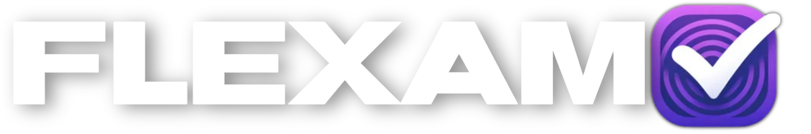

# FLEXAM: La Revolución del Aprendizaje Digital

## Autores
Alejandro de Mateo | Alejandro Paniagua | Martin Veselinov | Daniel García

## Concepto
FLEXAM es una plataforma web revolucionaria diseñada para transformar el arte de aprender y evaluar. Ofrecemos una experiencia educativa única, donde educadores, estudiantes y profesionales se convierten en creadores de tests altamente personalizables. En FLEXAM, cada test es más que una evaluación: es un portal hacia nuevos horizontes de conocimiento, adaptado a las necesidades individuales de cada usuario.

## Características Clave
- **Tests Personalizables**: Crea y comparte pruebas que se ajustan a las necesidades educativas específicas, desde la selección de preguntas hasta la puntuación.
- **Acceso Universal y Privado**: Los tests pueden ser públicos para fomentar la colaboración y el intercambio de sabiduría, o privados para una experiencia de aprendizaje personalizada.
- **Estadísticas Detalladas**: Transformamos datos en historias, proporcionando insights claros sobre el progreso y el potencial de cada individuo.
- **Plataforma Colaborativa**: Un espacio para compartir conocimientos y experiencias, impulsando el crecimiento colectivo.

## Usuarios y Tareas
- **Usuarios No Registrados**: Explorar y realizar tests públicos.
- **Usuarios Registrados**: Crear, modificar y realizar tests; acceder a estadísticas detalladas; configurar privacidad.
- **Anunciantes**: Promocionar productos o servicios en una plataforma dedicada a la educación y el desarrollo profesional.
- **Administradores**: Supervisar y mantener la plataforma, garantizando un entorno de aprendizaje óptimo.

## Visión Comercial
FLEXAM va más allá de ser una simple plataforma de tests; es una comunidad donde la innovación se encuentra con el conocimiento. Destacamos por nuestra capacidad de adaptación a las necesidades de cada usuario, ofreciendo una herramienta de aprendizaje que es tanto personalizable como accesible. En FLEXAM, cada test abre la puerta a un aprendizaje más profundo, preparando a los usuarios no solo para exámenes futuros sino para los desafíos de la vida real. Nuestra generación de ingresos se basa en publicidad dirigida a usuarios no registrados y en planes de pago que ofrecen una experiencia más rica y sin anuncios.

Bienvenidos a FLEXAM, la era del aprendizaje sin límites.
